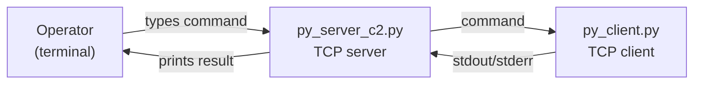

<p align="center">
  
</p>

<h1 align="center">py_c2</h1>
<p align="center">A tiny Python socket-based client/server command channel for <b>local lab / educational</b> use.</p>

<p align="center">
  <a href="https://github.com/vgg-dev/py_c2">
    
  </a>
  <a href="LICENSE">
    
  </a>
  
  <a href="https://github.com/vgg-dev/py_c2/commits/main">
    
  </a>
</p>

> [!IMPORTANT]
> **Authorized use only.** This repo demonstrates a basic remote command channel where the client executes safe built-in commands from the server and returns output.
>
> It is intentionally minimal and **not secure** (no authentication, no encryption, no hardening). Run only in a controlled environment (e.g., localhost, lab VM network).

## ✨ What’s in this repo

- `py_server_c2.py` — simple TCP server that accepts a client and sends operator-entered commands
- `py_client.py` — simple TCP client that connects and executes received commands
- `py_https_banner.py` — small helper that fetches an HTTPS banner via TLS + a basic HTTP request

## 🧭 Architecture (high level)



## 🚀 Quickstart (lab only)\r\n\r\n### Prerequisites\r\n\r\n- Python 3.x\r\n- Optional shared token via `PY_C2_TOKEN`\r\n\r\n### Run the server\r\n\r\n```bash\r\n# Optional: set a shared token (recommended)\r\nexport PY_C2_TOKEN=change-me\r\n\r\npython py_server_c2.py --host 127.0.0.1 --port 4444 --token "$PY_C2_TOKEN"\r\n```\r\n\r\n### Run the client\r\n\r\nIn a second terminal:\r\n\r\n```bash\r\npython py_client.py --server-host 127.0.0.1 --server-port 4444 --token "$PY_C2_TOKEN"\r\n```\r\n\r\n### Interaction\r\n\r\nType client-safe commands in the server prompt:\r\n\r\n- `help`\r\n- `ping`\r\n- `time`\r\n- `sysinfo`\r\n- `echo <text>`\r\n- `exit`\r\n\r\n## 🧰 HTTPS banner tool

Fetch a simple HTTPS banner for a host/port:

```bash
python py_https_banner.py example.com 443
```

## 🔐 Security notes

This project is a minimal demo and omits common safety/security controls, including:

- Authentication and authorization
- Transport encryption
- Input validation / command restrictions
- Auditing, logging, and tamper resistance

If you extend this for legitimate internal tooling, consider adding mutual authentication (e.g., mTLS), strict allowlists, and limiting the command surface.

## 📄 License

See `LICENSE`.


